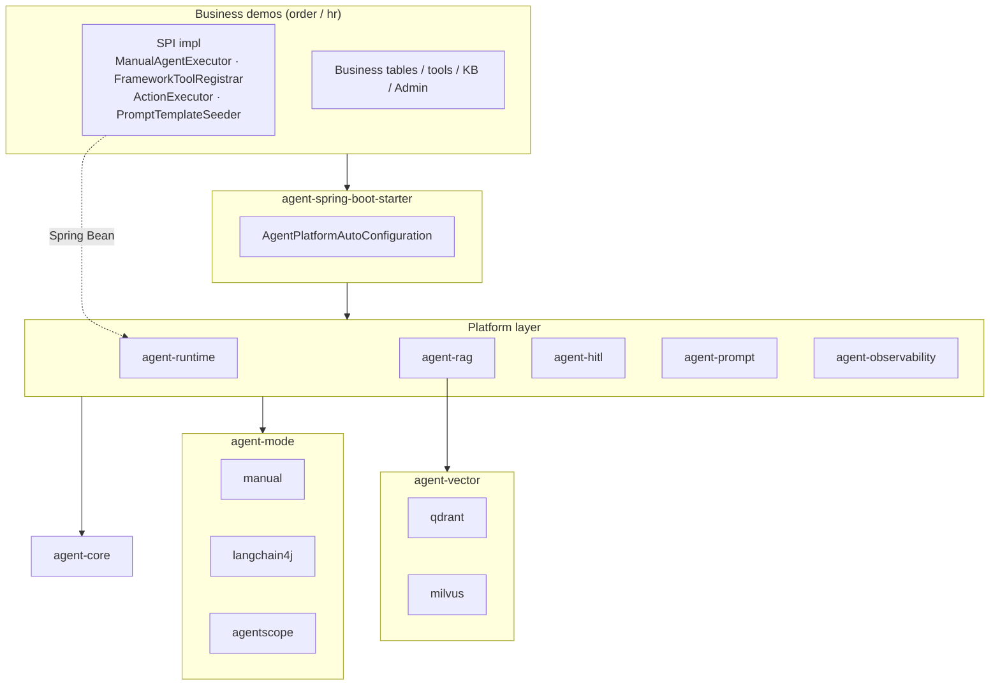
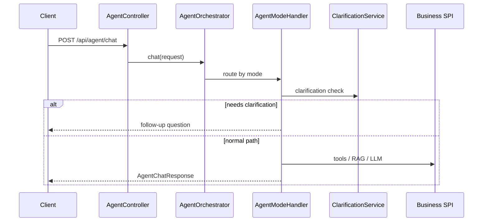

# AgentForge

**Language / 语言:** **English** | [简体中文](README.md)

**A multi-business Agent platform on Java 17 + Spring Boot 3**

The platform layer provides orchestration, RAG, HITL, and observability. Business logic plugs in via SPI. Two full demos (Order CS / HR CS) are included — ready to run, debug, and extend.

[](https://openjdk.org/)
[](https://spring.io/projects/spring-boot)
[](https://maven.apache.org/)

---

## Features

| Capability | Description |
| --- | --- |
| **SPI extension** | Maven multi-module + Spring Bean injection; new businesses implement a few interfaces and add the Starter |
| **Three Agent modes** | `manual` / `langchain4j` / `agentscope`; framework modes fall back to manual on failure |
| **Pluggable vector store** | Qdrant / Milvus, switch via `agent.vector-store.type` |
| **Dynamic knowledge base** | MySQL documents → chunked persistence → incremental vector sync |
| **Multi-turn chat + clarification** | `sessionId` for context; auto follow-up when order/employee ID is missing |
| **Write HITL** | Agent creates a request; execution happens only after human confirm |
| **RAG evaluation** | Built-in Q&A set; one-click regression via `POST /api/rag/eval` |
| **Prompt management** | DB templates + JetCache; five-segment `promptCode` |
| **Observability** | End-to-end traceId; tool/RAG hits persisted; Prometheus + Grafana |

---

## Demos

| Demo | Port | Database | Vector store | Description |
| --- | --- | --- | --- | --- |
| [order-cs-example](agent-examples/order-cs-example/) | 8080 | `order_agent_demo` | Qdrant | Orders, payments/refunds/benefits, HITL |
| [hr-cs-example](agent-examples/hr-cs-example/) | 8081 | `hr_agent_demo` | Milvus | Leave/payroll/benefits, HITL |
| [admin-console](agent-examples/admin-console/) | 8090 | — | — | Vue 3 unified admin console (dev) |

---

## Quick Start

### Requirements

```text
Java 17 · Maven 3.9+ · MySQL 8 · Docker Desktop
DASHSCOPE_API_KEY (optional; manual mode uses local templates without it)
```

### 1. Clone & build

```bash
git clone https://github.com/willaimsun1120/agent-parent.git
cd agent-parent
mvn test
```

### 2. Prepare MySQL

```bash
export MYSQL_HOST=127.0.0.1
export MYSQL_PORT=3306
export MYSQL_USERNAME=root
export MYSQL_PASSWORD=root123456
export MYSQL_DATABASE=order_agent_demo

mysql -h 127.0.0.1 -P 3306 -u root -p \
  -e "CREATE DATABASE IF NOT EXISTS order_agent_demo DEFAULT CHARACTER SET utf8mb4 COLLATE utf8mb4_unicode_ci;"
```

### 3. Configure LLM (optional)

```bash
export DASHSCOPE_API_KEY=your-dashscope-api-key
```

> Use environment variables for API keys in production; do not commit them to config files.

### 4. Start infrastructure

```bash
docker compose up -d qdrant redis prometheus grafana
```

On Apple Silicon, if Milvus fails to start:

```bash
cp docker-compose.override.example.yml docker-compose.override.yml
docker compose up -d milvus
```

### 5. Run a demo

```bash
cd agent-examples/order-cs-example && mvn spring-boot:run
```

Flyway runs migrations on first startup and seeds demo data automatically.

### 6. Verify

```bash
# Health check
curl http://127.0.0.1:8080/actuator/health

# Agent chat
curl -X POST http://127.0.0.1:8080/api/agent/chat \
  -H 'Content-Type: application/json' \
  -d '{"question":"Why can'\''t order ORD-1001 be refunded?"}'
```

### Endpoints

| Service | URL |
| --- | --- |
| Order Admin | http://127.0.0.1:8080/admin/ |
| HR Admin | http://127.0.0.1:8081/admin/ |
| Vue console | http://127.0.0.1:8090 (`cd agent-examples/admin-console && npm install && npm run dev`) |
| Prometheus | http://127.0.0.1:9090 |
| Grafana | http://127.0.0.1:3000 (admin / admin) |
| Qdrant Dashboard | http://127.0.0.1:6333/dashboard |

---

## Tech Stack

| Category | Choice |
| --- | --- |
| Language / framework | Java 17, Spring Boot 3.3.6 |
| Persistence | MySQL 8, Flyway, MyBatis-Plus |
| LLM / Embedding | Alibaba DashScope (Qwen) |
| Agent frameworks | Manual orchestration, LangChain4j 0.36, AgentScope 2.0-RC1 |
| Vector store | Qdrant (default), Milvus (optional) |
| Cache | JetCache (Caffeine local / Redis optional) |
| Observability | Spring Actuator, Prometheus, Grafana |

---

## Project Structure

```text
agent-parent/
├── agent-core                         # API, SPI contracts, platform config
├── agent-runtime                      # Orchestration, sessions, clarification, REST
├── agent-prompt                       # DB prompt templates + JetCache
├── agent-rag                          # Embedding, vector search, RAG eval
├── agent-vector/                      # Vector store aggregator
│   ├── agent-vector-core              # VectorStore SPI + config properties
│   ├── agent-vector-qdrant            # Qdrant implementation
│   └── agent-vector-milvus            # Milvus implementation
├── agent-hitl                         # Write HITL + ActionExecutor registry
├── agent-observability                # Sessions / tools / RAG hits + metrics
├── agent-mode/                        # Agent mode aggregator
│   ├── agent-mode-core                # Framework skeleton + fallback support
│   ├── agent-mode-manual              # manual mode handler
│   ├── agent-mode-langchain4j         # LangChain4j mode handler
│   └── agent-mode-agentscope          # AgentScope mode handler
├── agent-spring-boot-starter          # Auto-configuration
├── agent-examples/                    # Business demo aggregator
│   ├── order-cs-example/              # Order CS demo
│   │   └── src/main/resources/db/migration/   # Flyway migrations (V1~V11)
│   ├── hr-cs-example/                 # HR CS demo
│   │   └── src/main/resources/db/migration/   # Flyway migrations (V1~V5)
│   └── admin-console/                 # Vue 3 unified admin console
├── scripts/sql/                       # Full SQL bundles for both demos
│   ├── order_agent_demo_full.sql
│   ├── hr_agent_demo_full.sql
│   └── all_demos_full.sql
├── observability/                     # Prometheus config
│   └── prometheus.yml
├── docker-compose.yml                 # Qdrant / Milvus / Redis / Prometheus / Grafana
├── docker-compose.override.example.yml
└── pom.xml                            # Maven parent POM
```

<details>
<summary><b>Module responsibilities (expand)</b></summary>

| Module | Responsibility |
| --- | --- |
| `agent-core` | Request/response DTOs, `AgentMode`, SPI interfaces, `AgentPlatformProperties` |
| `agent-runtime` | `AgentOrchestrator`, `ClarificationService`, sessions, `AgentController` |
| `agent-prompt` | Prompt CRUD, JetCache warm-up/refresh |
| `agent-rag` | Vector search abstraction, embedding cache, RAG eval API |
| `agent-vector-core` | `VectorStore` SPI, decouples RAG from engine |
| `agent-hitl` | Pending write actions, routes by `actionType` to `ActionExecutor` |
| `agent-observability` | `agent_sessions` / `agent_tool_logs` / `rag_hit_logs` |
| `agent-mode-*` | Three mode handlers + framework fallback skeleton |
| `agent-spring-boot-starter` | `@AutoConfiguration`, wires platform beans |
| `agent-examples/*` | Business demos: schema, tools, knowledge base, admin UI |

</details>

### Architecture



### Request flow



---

## Database & SQL Scripts

The project uses **Flyway** for schema versioning. For day-to-day development, **start the demo app** and Flyway runs migrations automatically.

### Full SQL bundles (for manual init)

All Flyway migrations for both demos are merged in version order under [`scripts/sql/`](scripts/sql/):

| File | Database | Description |
| --- | --- | --- |
| [order_agent_demo_full.sql](scripts/sql/order_agent_demo_full.sql) | `order_agent_demo` | Order CS full schema (V1~V11: tables + demo data + KB + prompts) |
| [hr_agent_demo_full.sql](scripts/sql/hr_agent_demo_full.sql) | `hr_agent_demo` | HR CS full schema (V1~V5) |
| [all_demos_full.sql](scripts/sql/all_demos_full.sql) | Both | Initialize both demos in one run |

```bash
# Order demo
mysql -u root -p < scripts/sql/order_agent_demo_full.sql

# HR demo
mysql -u root -p < scripts/sql/hr_agent_demo_full.sql

# Both demos at once
mysql -u root -p < scripts/sql/all_demos_full.sql
```

> When Flyway migrations change, regenerate with `python3 scripts/sql/generate_full_sql.py` from the repo root. See [scripts/sql/README.md](scripts/sql/README.md).

### Flyway migration sources

Incremental migrations (run automatically by Flyway):

| Demo | Directory | Database | Scripts |
| --- | --- | --- | --- |
| Order CS | [order-cs-example/.../db/migration/](agent-examples/order-cs-example/src/main/resources/db/migration/) | `order_agent_demo` | 11 |
| HR CS | [hr-cs-example/.../db/migration/](agent-examples/hr-cs-example/src/main/resources/db/migration/) | `hr_agent_demo` | 5 |

### Order demo migrations

| Version | File | Description |
| --- | --- | --- |
| V1 | `V1__create_order_agent_schema.sql` | Business tables (users/orders/payments/refunds/benefits) + platform observability |
| V2 | `V2__insert_demo_data.sql` | Demo order data (ORD-1001 ~ ORD-1003) |
| V3 | `V3__add_table_and_column_comments.sql` | Table/column comments |
| V4 | `V4__knowledge_articles.sql` | Knowledge article table |
| V5 | `V5__agent_production_features.sql` | Chunks, multi-turn sessions, HITL, RAG eval |
| V6 | `V6__add_v4_v5_table_comments.sql` | Comments for V4/V5 tables |
| V7 | `V7__fix_conversation_turn_unique_key.sql` | Fix conversation turn unique key |
| V8 | `V8__knowledge_articles_zh_content.sql` | Chinese knowledge base content |
| V9 | `V9__agent_prompt_templates.sql` | Prompt template table |
| V10 | `V10__prompt_code_structure.sql` | Five-segment promptCode structure |
| V11 | `V11__agent_conversation_session_state.sql` | Session extended state |

### HR demo migrations

| Version | File | Description |
| --- | --- | --- |
| V1 | `V1__create_hr_agent_schema.sql` | Business tables (employees/leave/payroll/benefits) + platform tables |
| V2 | `V2__insert_demo_data.sql` | Demo employee data (EMP-1001 ~ EMP-1003) |
| V3 | `V3__knowledge_articles_zh_content.sql` | Chinese knowledge base content |
| V4 | `V4__add_table_and_column_comments.sql` | Table/column comments |
| V5 | `V5__fix_conversation_turn_unique_key.sql` | Fix conversation turn unique key |

### Schema overview

**Shared platform tables** (both demos):

| Table | Purpose |
| --- | --- |
| `agent_sessions` | Session summary (traceId, duration) |
| `agent_conversation_turns` | Multi-turn conversation details |
| `agent_conversations` | Session metadata |
| `agent_tool_logs` | Tool invocation logs |
| `rag_hit_logs` | RAG retrieval hits |
| `agent_action_requests` | HITL pending write actions |
| `knowledge_articles` / `knowledge_chunks` | Knowledge base articles and chunks |
| `agent_prompt_templates` | Prompt templates |
| `rag_eval_cases` | RAG evaluation cases |

**Order business tables**: `users` · `orders` · `payments` · `refunds` · `benefits`

**HR business tables**: `employees` · `leave_requests` · `payroll_records` · `hr_benefits`

> Full bundle scripts include `CREATE DATABASE`. For Flyway, create empty databases beforehand (or rely on JDBC `createDatabaseIfNotExist=true`).

---

## Configuration

### Platform settings

```yaml
agent:
  vector-store:
    type: qdrant              # qdrant | milvus
  platform:
    biz-domain: order         # order / hr
    biz-module: cs
    conversation:
      max-history-turns: 6
    clarification:
      enabled: true
    modes:
      default-mode: manual    # manual | agentscope | langchain4j
```

### Business key clarification

When order/employee ID is missing, the platform asks a follow-up. Config path: `agent.platform.clarification.biz-key.*`:

```yaml
agent:
  platform:
    clarification:
      biz-key:
        enabled: true
        pattern: "ORD-\\d+"
        trigger-keywords: [订单, 退款, 支付]
        missing-key-prompt: |
          Please provide an order number like ORD-1001...
        max-ask-times: 2
```

For HR, use `"EMP-\\d+"` and keywords like `[请假, 年假, 工资, 社保, 福利]`.

> Clarification is provided by platform `BizKeyClarificationPolicy`; override with a custom `ClarificationPolicy` bean if needed.

### Vector store switch

```yaml
agent:
  vector-store:
    type: milvus    # or export VECTOR_STORE_TYPE=milvus
```

| Value | Module | Typical use |
| --- | --- | --- |
| `qdrant` (default) | `agent-vector-qdrant` | Lightweight; order demo default |
| `milvus` | `agent-vector-milvus` | Large scale; HR demo default |

### Optional API auth

```bash
export APP_API_KEY_ENABLED=true
export APP_API_KEY=your-secret-key
curl http://127.0.0.1:8080/api/orders -H 'X-API-Key: your-secret-key'
```

---

## SPI Extension

Add a new module under `agent-examples/`, depend on `agent-spring-boot-starter`, implement SPIs as Spring beans:

| SPI | Role | Order demo | HR demo |
| --- | --- | --- | --- |
| `ManualAgentExecutor` | Manual mode orchestration | `OrderManualAgentExecutor` | `HrManualAgentExecutor` |
| `FrameworkToolRegistrar` | Framework mode tool registration | `OrderFrameworkToolRegistrar` | `HrFrameworkToolRegistrar` |
| `ActionExecutor` | HITL write execution | `SubmitRefundActionExecutor` etc. | `SubmitLeaveActionExecutor` etc. |
| `PromptTemplateSeeder` | Seed business prompts on startup | `OrderPromptTemplateSeeder` | `HrPromptTemplateSeeder` |
| `KnowledgeIngestionFacade` | Knowledge vector sync | `KnowledgeIngestionService` | `KnowledgeIngestionService` |
| `ClarificationPolicy` | Clarification (optional; config by default) | Platform `BizKeyClarificationPolicy` | Same |
| `RagCategoryResolver` | RAG category filter (optional) | Platform keyword/llm strategy | Same |

Minimal application class:

```java
@SpringBootApplication(scanBasePackages = {
    "com.agentforge.agent",       // platform
    "com.agentforge.order.cs"     // business
})
@MapperScan(basePackages = "com.agentforge.order.cs.order")
public class OrderCsExampleApplication { ... }
```

---

## API Reference

### Agent chat

```bash
# Single turn
curl -X POST http://127.0.0.1:8080/api/agent/chat \
  -H 'Content-Type: application/json' \
  -d '{"question":"Order ORD-1002 paid but status is wrong, what to do?"}'

# Multi-turn
curl -X POST http://127.0.0.1:8080/api/agent/chat \
  -H 'Content-Type: application/json' \
  -d '{"sessionId":"sess-xxx","question":"Order ORD-1001, why no refund?"}'

# Switch mode
curl -X POST http://127.0.0.1:8080/api/agent/chat \
  -H 'Content-Type: application/json' \
  -d '{"question":"Order ORD-1001, why no refund?","mode":"langchain4j"}'
```

### Other endpoints

| Endpoint | Description |
| --- | --- |
| `GET /api/orders` | List orders |
| `POST /api/knowledge/sync` | Sync knowledge to vector store |
| `POST /api/rag/eval` | RAG evaluation |
| `GET /api/agent/actions/pending` | Pending HITL actions |
| `POST /api/agent/actions/{id}/confirm` | Confirm write action |
| `GET /api/prompts/{promptCode}` | Get prompt template |
| `GET /api/observability/sessions/{traceId}` | View call trace |

### Agent modes

| mode | Description |
| --- | --- |
| `manual` (default) | Hand-written Java orchestration; transparent, good for debugging |
| `agentscope` | AgentScope ReActAgent; model picks tools |
| `langchain4j` | LangChain4j AiServices; model picks tools |

Framework modes fall back to manual on failure.

### Sample questions (order demo)

```text
Why can't this order be refunded?              → no order ID → clarification
Why can't order ORD-1001 be refunded?          → order lookup + RAG
ORD-1002 paid but status wrong, what to do?    → payment + knowledge base
Submit refund for ORD-1001, reason: mistake    → creates HITL pending action
```

---

## Observability

Each chat gets or propagates `X-Trace-Id`. Key data is persisted:

| Table | Purpose |
| --- | --- |
| `agent_sessions` | Session summary |
| `agent_conversation_turns` | Multi-turn details |
| `agent_tool_logs` | Tool calls |
| `rag_hit_logs` | RAG hits |
| `agent_action_requests` | HITL pending actions |
| `knowledge_articles` / `knowledge_chunks` | Knowledge base |
| `rag_eval_cases` | RAG eval cases |

Logs include `traceId:%X{traceId}` — correlate Admin UI, DB, and logs for one Agent call.

---

## Development

```bash
# Full test suite
mvn test

# Build one demo only
mvn install -pl agent-examples/order-cs-example -am
mvn install -pl agent-examples/hr-cs-example -am

# Dependency tree
cd agent-examples/order-cs-example && mvn dependency:tree
```

See also [agent-examples/README.md](agent-examples/README.md).

---

## Table of Contents

- [Features](#features)
- [Demos](#demos)
- [Quick Start](#quick-start)
- [Tech Stack](#tech-stack)
- [Project Structure](#project-structure)
- [Database & SQL Scripts](#database--sql-scripts)
- [Configuration](#configuration)
- [SPI Extension](#spi-extension)
- [API Reference](#api-reference)
- [Observability](#observability)
- [Development](#development)
