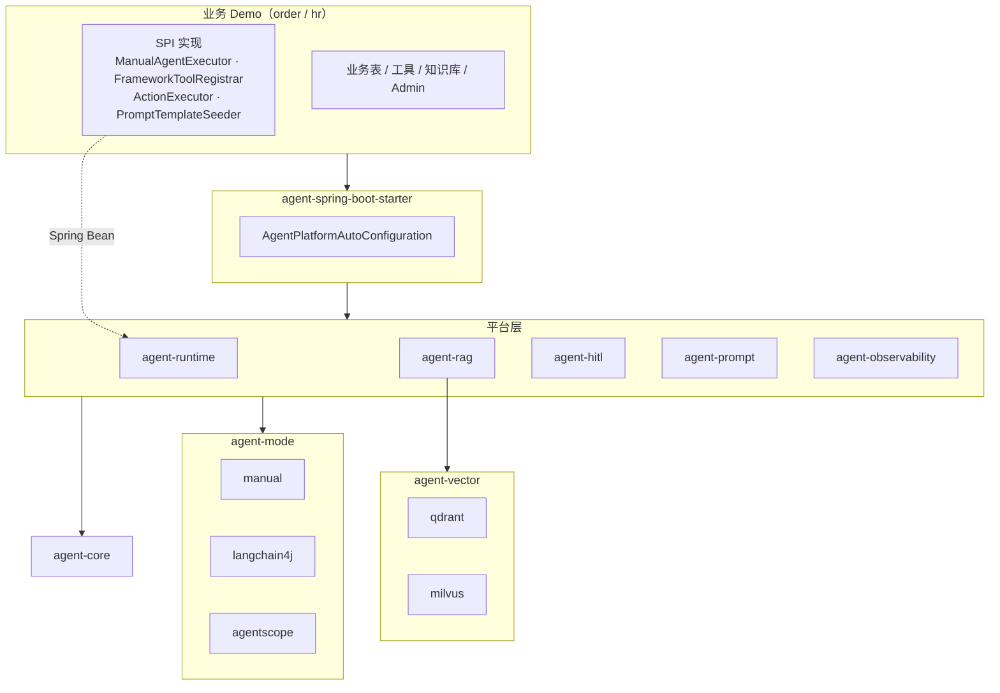
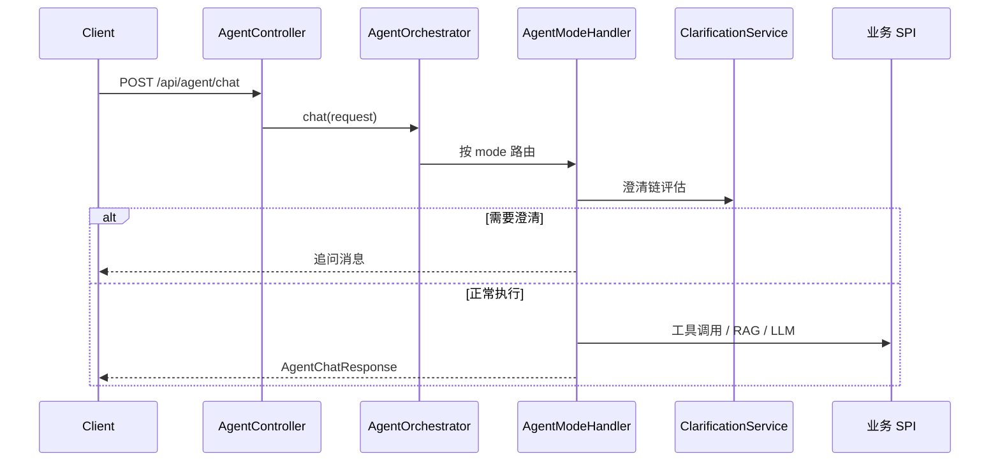

# AgentForge

**Language / 语言:** [English](README.en.md) | **简体中文**

**Java 17 + Spring Boot 3 的多业务 Agent 平台**

平台层提供编排、RAG、HITL、可观测等通用能力；业务层通过 SPI 接入。开箱即用两个完整 Demo（订单客服 / HR 客服），可直接运行、调试和二次开发。

[](https://openjdk.org/)
[](https://spring.io/projects/spring-boot)
[](https://maven.apache.org/)

---

## 特性

| 能力 | 说明 |
| --- | --- |
| **SPI 扩展** | Maven 多模块 + Spring Bean 注入，新业务只需实现若干接口并引入 Starter |
| **三种 Agent 模式** | `manual` / `langchain4j` / `agentscope`，框架模式失败自动降级到 manual |
| **可插拔向量库** | Qdrant / Milvus，通过 `agent.vector-store.type` 一行切换 |
| **动态知识库** | MySQL 管理文档 → 切片持久化 → 增量同步向量库 |
| **多轮对话 + 澄清** | `sessionId` 串联上下文，缺订单号/工号等业务主键时自动追问 |
| **写操作 HITL** | Agent 创建申请，人工 confirm 后才执行 |
| **RAG 评测** | 内置标准问答集，`POST /api/rag/eval` 一键回归 |
| **提示词管理** | DB 模板 + JetCache 缓存，支持五段式 `promptCode` |
| **可观测** | traceId 全链路，工具调用 / RAG 命中落库，Prometheus + Grafana |

---

## Demo 一览

| Demo | 端口 | 数据库 | 向量库 | 说明 |
| --- | --- | --- | --- | --- |
| [order-cs-example](agent-examples/order-cs-example/) | 8080 | `order_agent_demo` | Qdrant | 订单查询、支付/退款/权益、HITL |
| [hr-cs-example](agent-examples/hr-cs-example/) | 8081 | `hr_agent_demo` | Milvus | 请假/工资/福利、HITL |
| [admin-console](agent-examples/admin-console/) | 8090 | — | — | Vue 3 统一管理控制台（开发态） |

---

## 快速开始

### 环境要求

```text
Java 17 · Maven 3.9+ · MySQL 8 · Docker Desktop
DASHSCOPE_API_KEY（可选；未配置时 manual 模式使用本地模板回答）
```

### 1. 克隆 & 构建

```bash
git clone https://github.com/willaimsun1120/agent-parent.git
cd agent-parent
mvn test
```

### 2. 准备 MySQL

```bash
export MYSQL_HOST=127.0.0.1
export MYSQL_PORT=3306
export MYSQL_USERNAME=root
export MYSQL_PASSWORD=root123456
export MYSQL_DATABASE=order_agent_demo

mysql -h 127.0.0.1 -P 3306 -u root -p \
  -e "CREATE DATABASE IF NOT EXISTS order_agent_demo DEFAULT CHARACTER SET utf8mb4 COLLATE utf8mb4_unicode_ci;"
```

### 3. 配置 LLM（可选）

```bash
export DASHSCOPE_API_KEY=你的百炼APIKey
```

> 生产环境请通过环境变量注入 API Key，不要写入配置文件。

### 4. 启动基础设施

```bash
docker compose up -d qdrant redis prometheus grafana
```

Apple Silicon 上 Milvus 启动失败时：

```bash
cp docker-compose.override.example.yml docker-compose.override.yml
docker compose up -d milvus
```

### 5. 启动 Demo

```bash
cd agent-examples/order-cs-example && mvn spring-boot:run
```

Flyway 首次启动自动建表并写入 Demo 数据。

### 6. 验证

```bash
# 健康检查
curl http://127.0.0.1:8080/actuator/health

# Agent 问答
curl -X POST http://127.0.0.1:8080/api/agent/chat \
  -H 'Content-Type: application/json' \
  -d '{"question":"订单 ORD-1001 为什么不能退款？"}'
```

### 访问地址

| 服务 | 地址 |
| --- | --- |
| 订单 Admin | http://127.0.0.1:8080/admin/ |
| HR Admin | http://127.0.0.1:8081/admin/ |
| Vue 统一控制台 | http://127.0.0.1:8090（需 `cd agent-examples/admin-console && npm install && npm run dev`） |
| Prometheus | http://127.0.0.1:9090 |
| Grafana | http://127.0.0.1:3000（admin / admin） |
| Qdrant Dashboard | http://127.0.0.1:6333/dashboard |

---

## 技术栈

| 类别 | 选型 |
| --- | --- |
| 语言 / 框架 | Java 17，Spring Boot 3.3.6 |
| 持久化 | MySQL 8，Flyway，MyBatis-Plus |
| LLM / Embedding | 阿里云百炼 DashScope（Qwen） |
| Agent 框架 | Manual 编排，LangChain4j 0.36，AgentScope 2.0-RC1 |
| 向量库 | Qdrant（默认），Milvus（可选） |
| 缓存 | JetCache（Caffeine 本地 / Redis 可选） |
| 可观测 | Spring Actuator，Prometheus，Grafana |

---

## 项目结构

```text
agent-parent/
├── agent-core                         # API、SPI 契约、平台配置
├── agent-runtime                      # 编排、会话、澄清、REST API
├── agent-prompt                       # DB 提示词模板 + JetCache
├── agent-rag                          # Embedding、向量检索、RAG 评测
├── agent-vector/                      # 向量库聚合模块
│   ├── agent-vector-core              # VectorStore SPI 接口 + 配置属性
│   ├── agent-vector-qdrant            # Qdrant 实现
│   └── agent-vector-milvus            # Milvus 实现
├── agent-hitl                         # 写操作 HITL + ActionExecutor 注册表
├── agent-observability                # 会话 / 工具 / RAG 命中落库 + Metrics
├── agent-mode/                        # Agent 模式聚合模块
│   ├── agent-mode-core                # 框架模式公共骨架 + 降级支持
│   ├── agent-mode-manual              # manual 模式 Handler
│   ├── agent-mode-langchain4j         # LangChain4j 模式 Handler
│   └── agent-mode-agentscope          # AgentScope 模式 Handler
├── agent-spring-boot-starter          # 自动配置，聚合平台模块
├── agent-examples/                    # 业务 Demo 聚合
│   ├── order-cs-example/              # 订单客服 Demo
│   │   └── src/main/resources/db/migration/   # Flyway 迁移（V1~V11）
│   ├── hr-cs-example/                 # HR 客服 Demo
│   │   └── src/main/resources/db/migration/   # Flyway 迁移（V1~V5）
│   └── admin-console/                 # Vue 3 统一管理控制台
├── scripts/sql/                       # 两个 Demo 完整建库 SQL 汇总
│   ├── order_agent_demo_full.sql
│   ├── hr_agent_demo_full.sql
│   └── all_demos_full.sql
├── observability/                     # Prometheus 配置
│   └── prometheus.yml
├── docker-compose.yml                 # Qdrant / Milvus / Redis / Prometheus / Grafana
├── docker-compose.override.example.yml
└── pom.xml                            # Maven 父 POM
```

<details>
<summary><b>模块职责（展开）</b></summary>

| 模块 | 职责 |
| --- | --- |
| `agent-core` | 请求/响应 DTO、`AgentMode`、SPI 接口、`AgentPlatformProperties` |
| `agent-runtime` | `AgentOrchestrator` 编排、`ClarificationService`、会话状态、`AgentController` |
| `agent-prompt` | 提示词 CRUD、JetCache 预热/刷新 |
| `agent-rag` | 向量检索抽象、Embedding 缓存、RAG 评测 API |
| `agent-vector-core` | `VectorStore` SPI，解耦 RAG 与具体引擎 |
| `agent-hitl` | 待确认写操作、按 `actionType` 路由 `ActionExecutor` |
| `agent-observability` | `agent_sessions` / `agent_tool_logs` / `rag_hit_logs` |
| `agent-mode-*` | 三种 Agent 模式 Handler + 框架降级骨架 |
| `agent-spring-boot-starter` | `@AutoConfiguration`，扫描并装配平台 Bean |
| `agent-examples/*` | 业务 Demo：表结构、工具、知识库、Admin 页面 |

</details>

### 架构关系



### 请求链路



---

## 数据库与 SQL 脚本

项目使用 **Flyway** 管理数据库版本。日常开发**推荐直接启动 Demo**，Flyway 会自动执行迁移。

### 完整 SQL 汇总（推荐手动初始化时使用）

已将两个 Demo 的全部 Flyway 迁移按版本顺序合并，位于 [`scripts/sql/`](scripts/sql/)：

| 文件 | 数据库 | 说明 |
| --- | --- | --- |
| [order_agent_demo_full.sql](scripts/sql/order_agent_demo_full.sql) | `order_agent_demo` | 订单客服完整建库（V1~V11，含表结构 + Demo 数据 + 知识库 + 提示词） |
| [hr_agent_demo_full.sql](scripts/sql/hr_agent_demo_full.sql) | `hr_agent_demo` | HR 客服完整建库（V1~V5） |
| [all_demos_full.sql](scripts/sql/all_demos_full.sql) | 以上两个库 | 一次性初始化两个 Demo |

```bash
# 初始化订单 Demo
mysql -u root -p < scripts/sql/order_agent_demo_full.sql

# 初始化 HR Demo
mysql -u root -p < scripts/sql/hr_agent_demo_full.sql

# 一次性初始化两个 Demo
mysql -u root -p < scripts/sql/all_demos_full.sql
```

> 若 Flyway 迁移有更新，在仓库根目录执行 `python3 scripts/sql/generate_full_sql.py` 重新生成汇总脚本。详见 [scripts/sql/README.md](scripts/sql/README.md)。

### Flyway 迁移源文件

各 Demo 的增量迁移脚本（Flyway 自动执行）：

| Demo | 目录 | 数据库 | 脚本数 |
| --- | --- | --- | --- |
| 订单客服 | [order-cs-example/.../db/migration/](agent-examples/order-cs-example/src/main/resources/db/migration/) | `order_agent_demo` | 11 |
| HR 客服 | [hr-cs-example/.../db/migration/](agent-examples/hr-cs-example/src/main/resources/db/migration/) | `hr_agent_demo` | 5 |

### 订单 Demo 迁移脚本

| 版本 | 文件 | 说明 |
| --- | --- | --- |
| V1 | `V1__create_order_agent_schema.sql` | 业务表（users/orders/payments/refunds/benefits）+ 平台可观测表 |
| V2 | `V2__insert_demo_data.sql` | Demo 订单数据（ORD-1001 ~ ORD-1003） |
| V3 | `V3__add_table_and_column_comments.sql` | 表/字段注释 |
| V4 | `V4__knowledge_articles.sql` | 知识库文章表 |
| V5 | `V5__agent_production_features.sql` | 知识切片、多轮会话、HITL、RAG 评测 |
| V6 | `V6__add_v4_v5_table_comments.sql` | V4/V5 表注释 |
| V7 | `V7__fix_conversation_turn_unique_key.sql` | 修复对话轮次唯一键 |
| V8 | `V8__knowledge_articles_zh_content.sql` | 知识库中文正文 |
| V9 | `V9__agent_prompt_templates.sql` | 提示词模板表 |
| V10 | `V10__prompt_code_structure.sql` | 五段式 promptCode 结构 |
| V11 | `V11__agent_conversation_session_state.sql` | 会话扩展状态 |

### HR Demo 迁移脚本

| 版本 | 文件 | 说明 |
| --- | --- | --- |
| V1 | `V1__create_hr_agent_schema.sql` | 业务表（employees/leave_requests/payroll_records/hr_benefits）+ 平台表 |
| V2 | `V2__insert_demo_data.sql` | Demo 员工数据（EMP-1001 ~ EMP-1003） |
| V3 | `V3__knowledge_articles_zh_content.sql` | 知识库中文正文 |
| V4 | `V4__add_table_and_column_comments.sql` | 表/字段注释 |
| V5 | `V5__fix_conversation_turn_unique_key.sql` | 修复对话轮次唯一键 |

### 表结构概览

**平台公共表**（两个 Demo 均有）：

| 表名 | 用途 |
| --- | --- |
| `agent_sessions` | 会话摘要（traceId、耗时） |
| `agent_conversation_turns` | 多轮对话明细 |
| `agent_conversations` | 会话元数据 |
| `agent_tool_logs` | 工具调用记录 |
| `rag_hit_logs` | RAG 检索命中 |
| `agent_action_requests` | HITL 待确认写操作 |
| `knowledge_articles` / `knowledge_chunks` | 知识库文章与切片 |
| `agent_prompt_templates` | 提示词模板 |
| `rag_eval_cases` | RAG 评测用例 |

**订单业务表**：`users` · `orders` · `payments` · `refunds` · `benefits`

**HR 业务表**：`employees` · `leave_requests` · `payroll_records` · `hr_benefits`

> 使用完整汇总脚本时，已包含建库语句，无需单独 `CREATE DATABASE`。若通过 Flyway 启动 Demo，只需提前建空库（或由 JDBC URL 的 `createDatabaseIfNotExist=true` 自动创建）。

---

## 配置说明

### 平台级配置

```yaml
agent:
  vector-store:
    type: qdrant              # qdrant | milvus
  platform:
    biz-domain: order         # order / hr
    biz-module: cs
    conversation:
      max-history-turns: 6
    clarification:
      enabled: true
    modes:
      default-mode: manual    # manual | agentscope | langchain4j
```

### 业务主键澄清

缺订单号/工号时自动追问，配置路径 `agent.platform.clarification.biz-key.*`：

```yaml
agent:
  platform:
    clarification:
      biz-key:
        enabled: true
        pattern: "ORD-\\d+"
        trigger-keywords: [订单, 退款, 支付]
        missing-key-prompt: |
          我还没有识别到订单号。请先补充类似 ORD-1001 的订单号...
        max-ask-times: 2
```

HR 示例将 `pattern` 改为 `"EMP-\\d+"`，`trigger-keywords` 改为 `[请假, 年假, 工资, 社保, 福利]`。

> 澄清策略由平台 `BizKeyClarificationPolicy` 提供，也可自定义 `ClarificationPolicy` Bean 覆盖。

### 向量库切换

```yaml
agent:
  vector-store:
    type: milvus    # 或 export VECTOR_STORE_TYPE=milvus
```

| 配置值 | 模块 | 典型场景 |
| --- | --- | --- |
| `qdrant`（默认） | `agent-vector-qdrant` | 轻量部署，order Demo 默认 |
| `milvus` | `agent-vector-milvus` | 大规模向量，hr Demo 默认 |

### 可选 API 鉴权

```bash
export APP_API_KEY_ENABLED=true
export APP_API_KEY=your-secret-key
curl http://127.0.0.1:8080/api/orders -H 'X-API-Key: your-secret-key'
```

---

## SPI 扩展

新建模块放在 `agent-examples/` 下，依赖 `agent-spring-boot-starter`，实现 SPI 并注册为 Spring Bean：

| SPI | 职责 | 订单 Demo | HR Demo |
| --- | --- | --- | --- |
| `ManualAgentExecutor` | manual 模式业务编排 | `OrderManualAgentExecutor` | `HrManualAgentExecutor` |
| `FrameworkToolRegistrar` | 框架模式工具注册 | `OrderFrameworkToolRegistrar` | `HrFrameworkToolRegistrar` |
| `ActionExecutor` | HITL 写操作执行 | `SubmitRefundActionExecutor` 等 | `SubmitLeaveActionExecutor` 等 |
| `PromptTemplateSeeder` | 启动时写入业务提示词 | `OrderPromptTemplateSeeder` | `HrPromptTemplateSeeder` |
| `KnowledgeIngestionFacade` | 知识库向量同步 | `KnowledgeIngestionService` | `KnowledgeIngestionService` |
| `ClarificationPolicy` | 澄清追问（可选，默认走配置） | 平台 `BizKeyClarificationPolicy` | 同上 |
| `RagCategoryResolver` | RAG category 过滤（可选） | 平台 keyword/llm 策略 | 同上 |

最小启动类：

```java
@SpringBootApplication(scanBasePackages = {
    "com.agentforge.agent",       // 平台包
    "com.agentforge.order.cs"     // 业务包
})
@MapperScan(basePackages = "com.agentforge.order.cs.order")
public class OrderCsExampleApplication { ... }
```

---

## API 参考

### Agent 问答

```bash
# 单轮
curl -X POST http://127.0.0.1:8080/api/agent/chat \
  -H 'Content-Type: application/json' \
  -d '{"question":"订单 ORD-1002 支付成功但状态异常，怎么处理？"}'

# 多轮
curl -X POST http://127.0.0.1:8080/api/agent/chat \
  -H 'Content-Type: application/json' \
  -d '{"sessionId":"sess-xxx","question":"订单号是 ORD-1001，为什么不能退款？"}'

# 切换模式
curl -X POST http://127.0.0.1:8080/api/agent/chat \
  -H 'Content-Type: application/json' \
  -d '{"question":"订单 ORD-1001 为什么不能退款？","mode":"langchain4j"}'
```

### 其他常用接口

| 接口 | 说明 |
| --- | --- |
| `GET /api/orders` | 订单列表 |
| `POST /api/knowledge/sync` | 知识库向量同步 |
| `POST /api/rag/eval` | RAG 评测 |
| `GET /api/agent/actions/pending` | HITL 待确认操作 |
| `POST /api/agent/actions/{id}/confirm` | 确认写操作 |
| `GET /api/prompts/{promptCode}` | 查询提示词模板 |
| `GET /api/observability/sessions/{traceId}` | 查看调用 trace |

### 三种 Agent 模式

| mode | 说明 |
| --- | --- |
| `manual`（默认） | Java 关键词手写编排，逻辑透明，适合调试 |
| `agentscope` | AgentScope ReActAgent，模型自动选工具 |
| `langchain4j` | LangChain4j AiServices，模型自动选工具 |

框架模式异常时自动降级到 manual。

### 示例问题（订单 Demo）

```text
这个订单为什么不能退款？                    → 无订单号，触发澄清
订单 ORD-1001 为什么不能退款？              → 查订单 + RAG
订单 ORD-1002 支付成功但状态异常，怎么处理？  → 查支付 + 知识库
帮 ORD-1001 提交退款申请，原因是用户误购       → 创建 HITL 待确认操作
```

---

## 可观测

每次问答生成或透传 `X-Trace-Id`，关键数据落库：

| 表 | 用途 |
| --- | --- |
| `agent_sessions` | 会话摘要 |
| `agent_conversation_turns` | 多轮对话明细 |
| `agent_tool_logs` | 工具调用记录 |
| `rag_hit_logs` | RAG 检索命中 |
| `agent_action_requests` | HITL 待确认写操作 |
| `knowledge_articles` / `knowledge_chunks` | 知识库与切片 |
| `rag_eval_cases` | RAG 评测用例 |

日志格式含 `traceId:%X{traceId}`，可从 Admin 页面、数据库、日志三边对齐一次 Agent 调用。

---

## 开发与调试

```bash
# 全量测试
mvn test

# 只构建某个 Demo
mvn install -pl agent-examples/order-cs-example -am
mvn install -pl agent-examples/hr-cs-example -am

# 排查依赖
cd agent-examples/order-cs-example && mvn dependency:tree
```

更多示例说明见 [agent-examples/README.md](agent-examples/README.md)。

---

## 目录

- [特性](#特性)
- [Demo 一览](#demo-一览)
- [快速开始](#快速开始)
- [技术栈](#技术栈)
- [项目结构](#项目结构)
- [数据库与 SQL 脚本](#数据库与-sql-脚本)
- [配置说明](#配置说明)
- [SPI 扩展](#spi-扩展)
- [API 参考](#api-参考)
- [可观测](#可观测)
- [开发与调试](#开发与调试)
