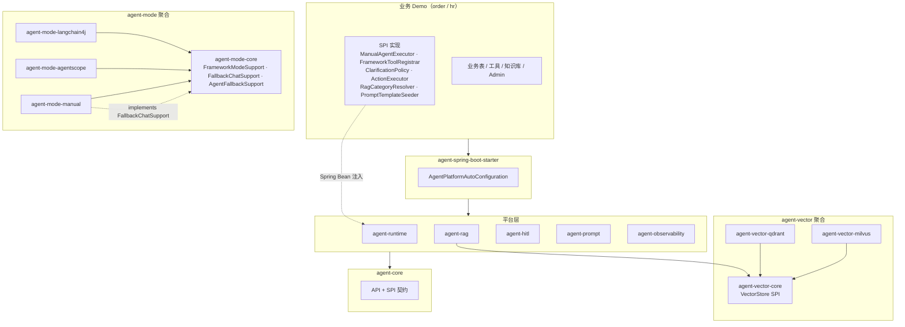
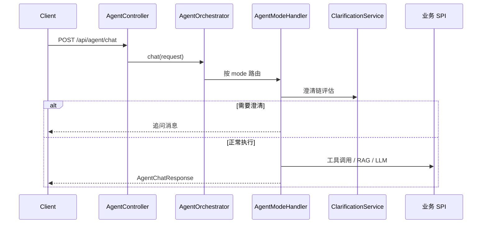

# AgentForge — 多业务 Agent 平台

Java 17 + Spring Boot 3 的多模块 Agent 平台。**平台层**提供编排、RAG、HITL、可观测等通用能力；**业务层**通过 SPI 接入，开箱即用两个完整 Demo：

| Demo | 端口 | 数据库 | 向量库（默认） |
| --- | --- | --- | --- |
| [order-cs-example](agent-examples/order-cs-example/) — 订单客服 | 8080 | `order_agent_demo` | Qdrant |
| [hr-cs-example](agent-examples/hr-cs-example/) — HR 客服 | 8081 | `hr_agent_demo` | Milvus |

---

## 目录

- [能力概览](#能力概览)
- [技术栈](#技术栈)
- [项目结构](#项目结构)
- [快速开始](#快速开始)
- [配置说明](#配置说明)
- [向量库切换](#向量库切换)
- [SPI 扩展](#spi-扩展)
- [API 与控制台](#api-与控制台)
- [可观测](#可观测)
- [开发与调试](#开发与调试)

---

## 能力概览

- **多业务扩展** — Maven 多模块 + SPI，新业务只需实现若干接口并引入 Starter
- **三种 Agent 模式** — `manual`（手写编排）、`agentscope`、`langchain4j`，框架模式失败可降级到 manual
- **可插拔向量库** — Qdrant / Milvus 通过 `agent.vector-store.type` 切换
- **动态知识库** — MySQL 管理文档 → 切片持久化 → 增量同步向量库
- **多轮对话** — `sessionId` 串联上下文，缺关键信息时澄清追问
- **写操作 HITL** — Agent 创建申请，人工确认后才执行
- **RAG 评测** — 内置标准问答集，一键跑检索命中率
- **提示词管理** — DB 模板 + JetCache 缓存，支持五段式 `promptCode`
- **可观测** — traceId、工具调用 / RAG 命中落库，Actuator + Prometheus + Grafana

---

## 技术栈

| 类别 | 选型 |
| --- | --- |
| 语言 / 框架 | Java 17，Spring Boot 3.3.6 |
| 持久化 | MySQL 8，Flyway，MyBatis-Plus |
| LLM / Embedding | 阿里云百炼 DashScope（Qwen） |
| Agent 框架 | Manual 编排，LangChain4j 0.36，AgentScope 2.0-RC1 |
| 向量库 | Qdrant（默认），Milvus（可选） |
| 缓存 | JetCache（Caffeine 本地 / Redis 可选） |
| 可观测 | Spring Actuator，Prometheus，Grafana |

---

## 项目结构

```text
agent-parent/
├── agent-core                   # API、SPI 契约、平台配置
├── agent-runtime                # 编排、会话、澄清、REST API
├── agent-prompt                 # DB 提示词模板 + JetCache
├── agent-rag                    # Embedding、向量检索、RAG 评测
├── agent-vector/                # 向量库聚合模块
│   ├── agent-vector-core        # VectorStore SPI 接口 + 配置属性
│   ├── agent-vector-qdrant      # Qdrant VectorStore 实现
│   └── agent-vector-milvus      # Milvus VectorStore 实现
├── agent-hitl                   # 写操作 HITL + ActionExecutor 注册表
├── agent-observability          # 会话 / 工具 / RAG 命中落库 + Metrics
├── agent-mode/                  # Agent 模式聚合模块
│   ├── agent-mode-core          # 公共骨架（FrameworkModeSupport、FallbackChatSupport、AgentFallbackSupport）
│   ├── agent-mode-manual        # manual 模式 Handler
│   ├── agent-mode-langchain4j   # LangChain4j 模式 Handler
│   └── agent-mode-agentscope    # AgentScope 模式 Handler
├── agent-spring-boot-starter    # 自动配置，聚合平台模块
├── docker-compose.yml           # Qdrant / Milvus / Redis / Prometheus / Grafana
└── agent-examples/
    ├── order-cs-example         # 订单客服 Demo
    ├── hr-cs-example            # HR 客服 Demo
    └── admin-console            # Vue 3 统一管理控制台（开发态）
```

### 模块职责

| 模块 | 职责 |
| --- | --- |
| `agent-core` | 请求/响应 DTO、`AgentMode`、SPI 接口、`AgentPlatformProperties` |
| `agent-runtime` | `AgentOrchestrator` 编排、`ClarificationService`、会话状态、`AgentController` |
| `agent-prompt` | 提示词 CRUD、JetCache 预热/刷新 |
| `agent-rag` | 向量检索抽象、Embedding 缓存、RAG 评测 API |
| `agent-vector-core` | `VectorStore` SPI 接口、`VectorStoreProperties`，解耦 RAG 与具体引擎 |
| `agent-vector-qdrant` | Qdrant `VectorStore` 实现，按配置条件装配 |
| `agent-vector-milvus` | Milvus `VectorStore` 实现，按配置条件装配 |
| `agent-hitl` | 待确认写操作、按 `actionType` 路由 `ActionExecutor` |
| `agent-observability` | `agent_sessions` / `agent_tool_logs` / `rag_hit_logs` |
| `agent-mode-core` | 框架模式公共骨架（`FrameworkModeSupport`）、降级接口（`FallbackChatSupport`）、降级组件（`AgentFallbackSupport`） |
| `agent-mode-manual` | manual 模式 `AgentModeHandler`，实现 `FallbackChatSupport` 供框架模式降级 |
| `agent-mode-langchain4j` | LangChain4j 模式 `AgentModeHandler`，继承 `FrameworkModeSupport` |
| `agent-mode-agentscope` | AgentScope 模式 `AgentModeHandler`，继承 `FrameworkModeSupport` |
| `agent-spring-boot-starter` | `@AutoConfiguration`，扫描并装配平台 Bean |
| `agent-examples/*` | 业务 Demo：表结构、工具、澄清策略、Admin 页面 |

### 架构关系



### 请求链路



---

## 快速开始

### 1. 环境要求

```text
Java 17
Maven 3.9+
MySQL 8
Docker Desktop（Qdrant / Milvus / Redis / Prometheus / Grafana）
DASHSCOPE_API_KEY（可选；未配置时 manual 模式使用本地模板回答）
```

### 2. 准备 MySQL

```bash
export MYSQL_HOST=127.0.0.1
export MYSQL_PORT=3306
export MYSQL_USERNAME=root
export MYSQL_PASSWORD=root123456

# 订单 Demo 数据库
export MYSQL_DATABASE=order_agent_demo
mysql -h 127.0.0.1 -P 3306 -u root -p \
  -e "CREATE DATABASE IF NOT EXISTS order_agent_demo DEFAULT CHARACTER SET utf8mb4 COLLATE utf8mb4_unicode_ci;"

# HR Demo 数据库（可选，启动 HR 示例时需要）
mysql -h 127.0.0.1 -P 3306 -u root -p \
  -e "CREATE DATABASE IF NOT EXISTS hr_agent_demo DEFAULT CHARACTER SET utf8mb4 COLLATE utf8mb4_unicode_ci;"
```

### 3. 配置 DashScope

```bash
export DASHSCOPE_API_KEY=你的百炼APIKey
```

> 生产环境请通过环境变量注入 API Key，不要依赖配置文件中的默认值。

### 4. 启动基础设施

本目录 `docker-compose.yml` 提供 Qdrant、Milvus、Redis、Prometheus、Grafana：

```bash
# 在本目录 agent-parent
cp .env.example .env          # 可选：镜像源 / Apple Silicon 参数

docker compose up -d qdrant redis prometheus grafana   # 订单 Demo（Qdrant）
docker compose up -d milvus redis prometheus grafana   # HR Demo（Milvus，含 Attu UI）

# 验证
curl http://127.0.0.1:6333/collections     # Qdrant
curl http://127.0.0.1:9091/healthz         # Milvus
```

Apple Silicon 上 Milvus 启动失败时：

```bash
cp docker-compose.override.example.yml docker-compose.override.yml
```

### 5. 构建与启动

```bash
# 全量构建 + 测试
mvn test

# 启动订单客服 Demo
cd agent-examples/order-cs-example && mvn spring-boot:run

# 启动 HR 客服 Demo（另开终端）
cd agent-examples/hr-cs-example && mvn spring-boot:run
```

Flyway 会在首次启动时自动建表并写入 Demo 数据。

### 6. 访问地址

| 服务 | 地址 |
| --- | --- |
| 订单 Admin（内置静态页） | http://127.0.0.1:8080/admin/ |
| HR Admin（内置静态页） | http://127.0.0.1:8081/admin/ |
| Vue 统一管理控制台（开发态） | http://127.0.0.1:8090（见下方说明） |
| 健康检查 | http://127.0.0.1:8080/actuator/health |
| Prometheus 指标 | http://127.0.0.1:8080/actuator/prometheus |
| Prometheus UI | http://127.0.0.1:9090 |
| Grafana | http://127.0.0.1:3000（admin / admin） |
| Qdrant Dashboard | http://127.0.0.1:6333/dashboard |
| Milvus Attu | http://127.0.0.1:8000 |

**Vue 管理控制台**（`agent-examples/admin-console`）聚合订单与 HR 两个 Demo，适合本地联调：

```bash
cd agent-examples/admin-console
npm install && npm run dev    # http://127.0.0.1:8090
```

各 Demo 仍自带 `/admin/` 静态页，不依赖前端工程即可使用。

---

## 配置说明

### 平台级配置

在 Demo 的 `application.yml` 中设置 `agent.platform.*`：

```yaml
agent:
  vector-store:
    type: qdrant              # qdrant | milvus，也可用环境变量 VECTOR_STORE_TYPE
  platform:
    biz-domain: order         # 业务领域：order / hr
    biz-module: cs            # 业务模块
    conversation:
      max-history-turns: 6
    clarification:
      enabled: true
    modes:
      default-mode: manual    # manual | agentscope | langchain4j
```

### 业务主键澄清配置

当用户问题涉及业务但未提供主键（如订单号、工号）时，平台自动追问，避免 Agent 无上下文盲目回答。
配置路径 `agent.platform.clarification.biz-key.*`：

```yaml
agent:
  platform:
    clarification:
      enabled: true
      biz-key:
        enabled: true
        pattern: "ORD-\\d+"                       # 业务主键正则
        trigger-keywords: [订单, 退款, 支付]         # 触发澄清的关键词
        missing-key-prompt: |                      # 追问话术
          我还没有识别到订单号。请先补充类似 ORD-1001 的订单号...
        max-ask-times: 2                           # 同一会话最大追问次数
```

HR 示例将 `pattern` 改为 `"EMP-\\d+"`，`trigger-keywords` 改为 `[请假, 年假, 工资, 社保, 福利]`。

### 可选 API 鉴权

默认关闭。启用后，除 `/admin/`、`/actuator/*` 外，所有 `/api/*` 需携带 `X-API-Key`：

```bash
export APP_API_KEY_ENABLED=true
export APP_API_KEY=your-secret-key

curl http://127.0.0.1:8080/api/orders -H 'X-API-Key: your-secret-key'
```

---

## 向量库切换

向量检索通过 `agent-vector-core` 中的 `VectorStore` SPI 与具体引擎解耦：

| 配置值 | 模块 | 典型场景 |
| --- | --- | --- |
| `qdrant`（默认） | `agent-vector-qdrant` | 轻量部署，order Demo 默认 |
| `milvus` | `agent-vector-milvus` | 大规模向量，hr Demo 默认 |

切换方式：

```yaml
agent:
  vector-store:
    type: milvus
```

或：

```bash
export VECTOR_STORE_TYPE=milvus
```

对应连接参数见各 Demo 的 `application.yml` 中 `qdrant.*` / `milvus.*` 节。

---

## SPI 扩展

新建模块放在 `agent-examples/` 下，依赖 `agent-spring-boot-starter`，实现以下 SPI 并注册为 Spring Bean：

| SPI | 职责 | 订单 Demo | HR Demo |
| --- | --- | --- | --- |
| `ManualAgentExecutor` | manual 模式业务编排 | `OrderManualAgentExecutor` | `HrManualAgentExecutor` |
| `FrameworkToolRegistrar` | 框架模式工具注册 | `OrderFrameworkToolRegistrar` | `HrFrameworkToolRegistrar` |
| `ClarificationPolicy` | 缺信息时澄清追问 | `OrderClarificationPolicy` | `HrClarificationPolicy` |
| `ActionExecutor` | HITL 写操作执行 | `SubmitRefundActionExecutor` 等 | `SubmitLeaveActionExecutor` 等 |
| `RagCategoryResolver` | 问题 → RAG category 过滤 | `OrderRagCategoryResolver` | `HrRagCategoryResolver` |
| `PromptTemplateSeeder` | 启动时写入业务提示词 | `OrderPromptTemplateSeeder` | `HrPromptTemplateSeeder` |
| `KnowledgeIngestionFacade` | 知识库向量同步（可选） | `KnowledgeIngestionService` | `KnowledgeIngestionService` |
| `LocalKnowledgeSource` | 本地兜底知识（可选） | — | — |

最小启动类参考 `OrderCsExampleApplication`：

```java
@SpringBootApplication(scanBasePackages = {
    "com.agentforge.agent",       // 平台包
    "com.agentforge.order.cs"     // 业务包
})
@MapperScan(basePackages = "com.agentforge.order.cs.order")
@EnableConfigurationProperties({ AgentPlatformProperties.class, ... })
public class OrderCsExampleApplication { ... }
```

---

## API 与控制台

### 常用 curl

```bash
# 订单
curl http://127.0.0.1:8080/api/orders
curl -X POST http://127.0.0.1:8080/api/knowledge/sync
curl -X POST http://127.0.0.1:8080/api/rag/eval

# 单轮问答
curl -X POST http://127.0.0.1:8080/api/agent/chat \
  -H 'Content-Type: application/json' \
  -d '{"question":"订单 ORD-1002 支付成功但状态异常，怎么处理？"}'

# 多轮对话
curl -X POST http://127.0.0.1:8080/api/agent/chat \
  -H 'Content-Type: application/json' \
  -d '{"sessionId":"sess-xxx","question":"订单号是 ORD-1001，为什么不能退款？"}'

# 切换 Agent 模式
curl -X POST http://127.0.0.1:8080/api/agent/chat \
  -H 'Content-Type: application/json' \
  -d '{"question":"订单 ORD-1001 为什么不能退款？","mode":"langchain4j"}'

# HITL
curl http://127.0.0.1:8080/api/agent/actions/pending
curl -X POST http://127.0.0.1:8080/api/agent/actions/{actionId}/confirm
```

### 三种 Agent 模式

| mode | 说明 |
| --- | --- |
| `manual`（默认） | Java 关键词手写编排，逻辑透明，适合调试 |
| `agentscope` | AgentScope ReActAgent，模型自动选工具 |
| `langchain4j` | LangChain4j AiServices，模型自动选工具 |

框架模式异常时会自动降级到 manual。降级通过 `agent-mode-core` 中的 `FallbackChatSupport` 接口解耦——`ManualAgentModeHandler` 实现该接口，框架模式 Handler 通过接口注入，无需编译期依赖 manual 模块。

### 示例问题（订单 Demo）

```text
这个订单为什么不能退款？                    → 无订单号，触发澄清追问
订单 ORD-1001 为什么不能退款？              → 查订单 + RAG
订单 ORD-1002 支付成功但状态异常，怎么处理？  → 查支付 + 知识库
帮 ORD-1001 提交退款申请，原因是用户误购       → 创建 HITL 待确认操作
```

---

## 可观测

每次问答生成或透传 `X-Trace-Id`，关键数据落库：

| 表 | 用途 |
| --- | --- |
| `agent_sessions` | 会话摘要（sessionId、turnIndex、耗时） |
| `agent_conversation_turns` | 多轮对话明细 |
| `agent_tool_logs` | 工具调用记录 |
| `rag_hit_logs` | RAG 检索命中 |
| `agent_action_requests` | HITL 待确认写操作 |
| `knowledge_articles` / `knowledge_chunks` | 知识库真相源与切片 |
| `rag_eval_cases` | RAG 评测用例 |

日志格式含 `traceId:%X{traceId}`，可从 Admin 页面、数据库、日志三边对齐一次 Agent 调用。

### Demo 已实现的生产级能力

| 能力 | 说明 |
| --- | --- |
| 知识库真相源 | MySQL 文章 → 切片 → 向量库 |
| 增量向量同步 | 发布/更新前删旧 points，下架也会清理 |
| 多轮 session | 最近 N 轮进 prompt |
| 澄清追问 | 缺关键实体（订单号 / 工号）时先追问 |
| 知识引用 | 回答末尾标注 `doc_code v版本 · 标题` |
| category 过滤 | RAG 按业务 category 过滤 |
| 写操作 HITL | 敏感操作人工 confirm 后执行 |
| RAG 评测 | `POST /api/rag/eval` 标准问答回归 |
| 提示词缓存 | JetCache 本地缓存，启动 warmup、修改 refresh |

---

## 开发与调试

```bash
# 全量测试
mvn test

# 只构建某个 Demo 及其依赖
mvn install -pl agent-examples/order-cs-example -am
mvn install -pl agent-examples/hr-cs-example -am

# 单模块测试
mvn test -pl agent-examples/hr-cs-example -am

# 排查 classpath 冲突
cd agent-examples/order-cs-example && mvn dependency:tree
```

更多示例说明见 [agent-examples/README.md](agent-examples/README.md)。
